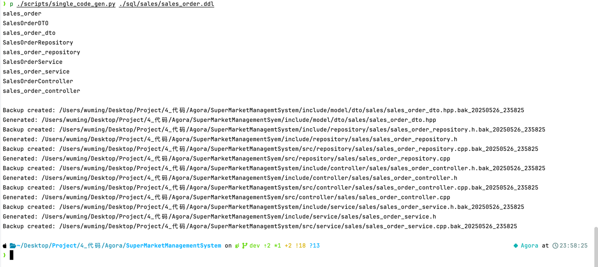

## 初始化业务代码配置

---

#### 初始化（你们不需要看，暂时用不到）
> 保证当前在程序根目录 Agora 下

##### 创建虚拟环境
`python -m venv`

##### 启动虚拟环境
`source venv/bin/active`

##### 安装脚本依赖
`pip install -r requirements.txt`

---

#### 生成文件
##### 进入 `SuperMarketManagementSystem` 下
`cd SuperMarketManagementSystem`

##### 运行脚本生成对应的头文件和源文件
`python ./scripts/single_code_gen.py <指定的 ddl 文件>`
> 例如：`python ./scripts/single_code_gen.py ./sql/sales/sales_order.ddl`
> 
> 这将生成 sales_order 这张表单对应的所有文件


如图所示，生成了类似这样的文件就说明正确

---

### 修改文件
#### 首先修改 `xxx_dto.hpp` 
> `xxx` 就是对应的表名，比如 `sales_order` 对应的就是 `sales_order_dto.hpp`

##### 先改上半部分
``` C++
struct SalesOrderDTO : public CacheFuncGetter {
  inline static const std::vector<std::string> required_fields = Ellipsis;
  inline static const std::vector<std::string> _domain = Ellipsis;

  in_id_type id = 0;
  std::string order_id = "";
  datetime_type sale_time = {};
  in_id_type cashier_rk_id = 0;
  in_id_type member_rk_id = 0;
  double total_amount = 0.0;
  double paid_amount = 0.0;
  std::string payment_method = "";
  std::string payment_method = "";
  std::string discount_info = "";
  std::string remark = "";
```
> 先修改 `required_fields`，改成下面的样子

注意，示例的是格式化后的样子，因此排版会整齐一些，但是不会影响运行
``` C++
inline static const std::vector<std::string> required_fields = {
"order_id",       "sale_time",     "cashier_id",
"member_id",      "total_amount",  "paid_amount",
"payment_method", "discount_info", "remark"};
```
> 我们需要将除 `id` 之外的所有字段添加到里面，对于有 rk_ 的字段，需要将 rk_ 删除
> 
> 例如：`cashier_rk_id` -> `cashier_id`


--- 

> 再修改 `_domain`，改成下面的样子
``` C++
inline static const std::vector<std::string> payment_method_domain = {
"cash", "bank_card", "wechat", "alipay", "other"};
```

> 其中的字段都是 `sales_order.ddl` 中 payment_method_domain 对应的 
```sql
payment_method TEXT NOT NULL CHECK (
    payment_method IN ('cash', 'bank_card', 'wechat', 'alipay', 'other')
)
```
> 这里的 domain 的和 CHECK 里的内容要意义对应，假如 ddl 中还有其他 CHECK 约束，例如
> 
> `status TEXT CHECK (status IN ('active', 'inactive', 'locked')) DEFAULT 'active', -- 用户状态`
> 则需要创建 inline static const std::vector<std::string> stauts_doamin = {...


--- 

#### 接着修改序列化（to_json）与反序列化（from_json）部分
##### 修改反序列化（from_json）
```C++
  static SalesOrderDTO from_json(const nlohmann::json& j)
  {
    try {
      return SalesOrderDTO{
        .order_id = j.at("order_id").get<std::string>(),
        .sale_time =
          utils::string_to_time(j.at("sale_time").get<std::string>()),
        .cashier_rk_id = j.at("cashier_rk_id").get<in_id_type>(),
        .member_rk_id = j.at("member_rk_id").get<in_id_type>(),
        .total_amount = j.at("total_amount").get<double>(),
        .paid_amount = j.at("paid_amount").get<double>(),
        .payment_method = j.at("payment_method").get<std::string>(),
        .payment_method = j.at("payment_method").get<std::string>(),
        .discount_info = j.at("discount_info").get<std::string>(),
        .remark = j.at("remark").get<std::string>(),
      };
    }
    catch (const std::exception& e) {
      std::cerr << "[from_json error] " << e.what() << "\n"
                << "Input JSON: " << j.dump(2) << std::endl;
      throw;
    }
  }
```
1. 查看 ddl 中的涉及时间的字段（DATETIME、DATE、TIME）
> `sale_time DATETIME NOT NULL,`
 
发现是 DATETIME，在代码中查找是否是 string_to_datetime，不是则改成这个
> 假如是 DATE，则改成 string_to_date

2. 接着改外键（带 rk 的，也可以去 ddl 中查看）
> `.cashier_rk_id = j.at("cashier_rk_id").get<in_id_type>(),`
> 或
> `FOREIGN KEY (cashier_rk_id) REFERENCES employee (id),`
对于这种的，要在 `j.at("..` 外套一层函数
> 
> 如下：
原本
``` C++
.cashier_rk_id = j.at("cashier_rk_id").get<in_id_type>(),
```
改成
``` C++
.cashier_rk_id =
  getInternalId("employee", j.at("cashier_id").get<ex_id_type>()),
```
> 这里的 "employee" 对应 ddl 中的 `REFERENCES employee (id)`，同时将类型 `in_id_type` 改为 `ex_id_type`

3. 删除重复的
``` C++
.payment_method = j.at("payment_method").get<std::string>(),
.payment_method = j.at("payment_method").get<std::string>(),
```
这种直接删去其中一个即可

更改后：
``` C++
.payment_method = j.at("payment_method").get<std::string>(),
```


##### 改完后
``` C++
  static SalesOrderDTO from_json(const nlohmann::json& j)
  {
    try {
      return SalesOrderDTO{
        .order_id = j.at("order_id").get<std::string>(),
        .sale_time =
          utils::string_to_datetime(j.at("sale_time").get<std::string>()),
        .cashier_rk_id =
          getInternalId("employee", j.at("cashier_id").get<ex_id_type>()),
        .member_rk_id =
          getInternalId("member", j.at("member_id").get<ex_id_type>()),
        .total_amount = j.at("total_amount").get<double>(),
        .paid_amount = j.at("paid_amount").get<double>(),
        .payment_method = j.at("payment_method").get<std::string>(),
        .discount_info = j.at("discount_info").get<std::string>(),
        .remark = j.at("remark").get<std::string>(),
      };
    }
    catch (const std::exception& e) {
      std::cerr << "[from_json error] " << e.what() << "\n"
                << "Input JSON: " << j.dump(2) << std::endl;
      throw;
    }
  }
```

---
##### 接着改序列化（to_json）
``` C++
inline void to_json(nlohmann::json& j, const SalesOrderDTO& sales_order_dto)
{
  j = nlohmann::json{
    {"id", sales_order_dto.id},
    {"order_id", sales_order_dto.order_id},
    {"sale_time", utils::time_to_string(sales_order_dto.sale_time)},
    {"cashier_rk_id", sales_order_dto.cashier_rk_id},
    {"member_rk_id", sales_order_dto.member_rk_id},
    {"total_amount", sales_order_dto.total_amount},
    {"paid_amount", sales_order_dto.paid_amount},
    {"payment_method", sales_order_dto.payment_method},
    {"payment_method", sales_order_dto.payment_method},
    {"discount_info", sales_order_dto.discount_info},
    {"remark", sales_order_dto.remark}};
}
```
对于序列化，大致步骤相同
1. 更改时间
 
原本:

`{"sale_time", utils::time_to_string(sales_order_dto.sale_time)},`

更改后：

`{"sale_time", utils::datetime_to_string(sales_order_dto.sale_time)},`
> 也是根据 DATETIME、... 之类的改

2. 更改外键

原本：

`{"cashier_rk_id", sales_order_dto.cashier_rk_id},`

更改后：
 
``` C++
{"cashier_id", SalesOrderDTO::getExternalId("employee", sales_order_dto.cashier_rk_id)},
```
> 先讲 "cashier_rk_id" 改为 "cashier_id"
> 
> 然后在外面嵌套一层 `SalesOrderDTO::getExternalId("employee", ...`
> 
> 这里的 SalesOrderDTO 对应前面更改的类型，`employee` 依旧是参照 `REFERENCES employee (id)`
> 

3. 去除重复的
```C++
{"payment_method", sales_order_dto.payment_method},
{"payment_method", sales_order_dto.payment_method},
```

改成：

```C++
{"payment_method", sales_order_dto.payment_method},
```

改完后：
```C++
inline void to_json(nlohmann::json& j, const SalesOrderDTO& sales_order_dto)
{
  j = nlohmann::json{
    {"id", sales_order_dto.id},
    {"order_id", sales_order_dto.order_id},
    {"sale_time", utils::datetime_to_string(sales_order_dto.sale_time)},
    {"cashier_id",
     SalesOrderDTO::getExternalId("employee", sales_order_dto.cashier_rk_id)},
    {"member_id",
     SalesOrderDTO::getExternalId("member", sales_order_dto.member_rk_id)},
    {"total_amount", sales_order_dto.total_amount},
    {"paid_amount", sales_order_dto.paid_amount},
    {"payment_method", sales_order_dto.payment_method},
    {"payment_method", sales_order_dto.payment_method},
    {"discount_info", sales_order_dto.discount_info},
    {"remark", sales_order_dto.remark}};
}
```

---

#### 最后更改这个文件的 `ReflectTable` 和 `assigne_model` 
找出里面重复的行即可

例如：(ReflectTable) 中
```C++
std::make_pair(&SalesOrderDTO::paid_amount, &db::sales_order::paid_amount),
std::make_pair(&SalesOrderDTO::payment_method,
               &db::sales_order::payment_method),
std::make_pair(&SalesOrderDTO::payment_method,
               &db::sales_order::payment_method),
std::make_pair(&SalesOrderDTO::discount_info,
               &db::sales_order::discount_info),
std::make_pair(&SalesOrderDTO::remark, &db::sales_order::remark));
```
删除重复的即可

```C++
std::make_pair(&SalesOrderDTO::paid_amount, &db::sales_order::paid_amount),
std::make_pair(&SalesOrderDTO::payment_method,
               &db::sales_order::payment_method),
std::make_pair(&SalesOrderDTO::discount_info,
               &db::sales_order::discount_info),
std::make_pair(&SalesOrderDTO::remark, &db::sales_order::remark));
```

对于 assign_model 同理

删除前：
```C++ .paid_amount = row.paid_amount,
.payment_method = row.payment_method,
.payment_method = row.payment_method,
.discount_info = row.discount_info,
```

删除后：
```C++
.paid_amount = row.paid_amount,
.payment_method = row.payment_method,
.discount_info = row.discount_info,
```

---

##### 接着查看 `fix_controller.md` 查看如何修改剩下的文件